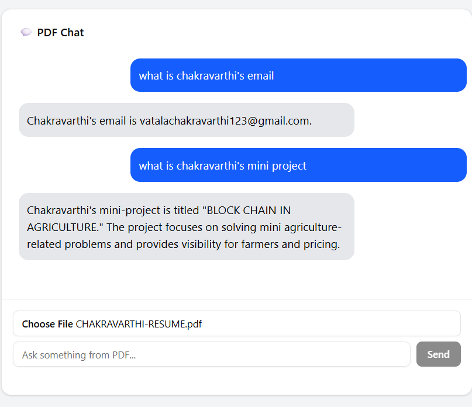

# 📄 PDF Chat App

A simple Node + React-based app to **upload a PDF and ask questions** from its content.

---

## 🔍 How It Works

### 🧭 Steps:

1. **Upload a PDF File**  
   Click the **"Choose File"** button and select a PDF (e.g., a resume).

2. **Ask a Question**  
   Type any question related to the content of the PDF in the input box .

3. **Get an Answer Instantly**  
   The app processes the PDF and returns an accurate answer from the document using vector embeddings and retrieval-augmented generation.

---

